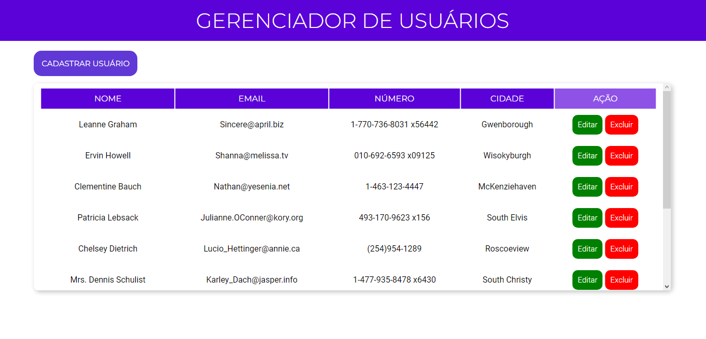
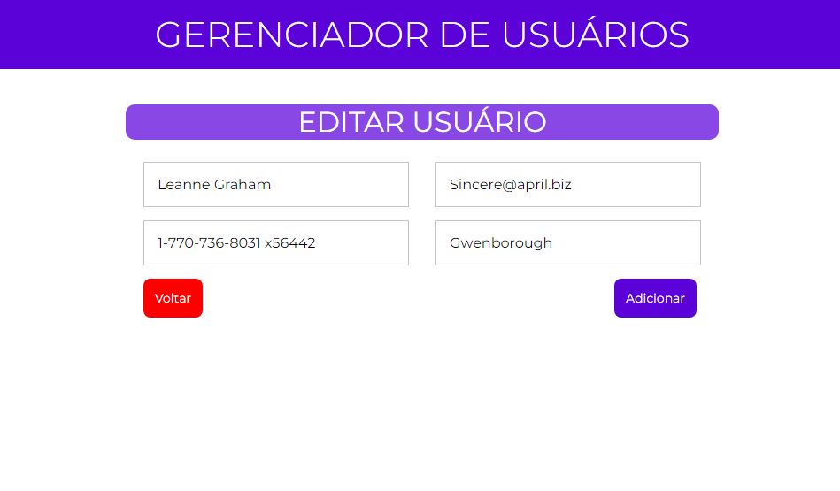
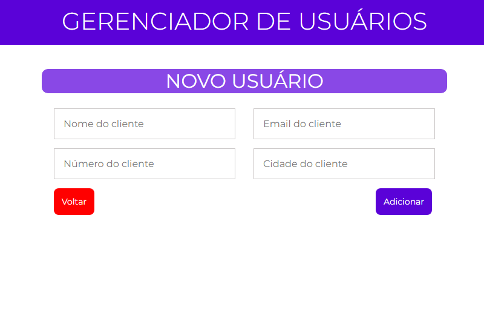

 <h1 align="center">Gerenciador de Usuários</h1>

 
Gerenciador de Usuários (CRUD) feito com ReactJs, TypeScript e Styled Components. Usado como API: "jsonplaceholder".

 
 
<a href="https://gerenciador-usuarios.vercel.app" target="_blank">Acesse aqui.</a>

 

